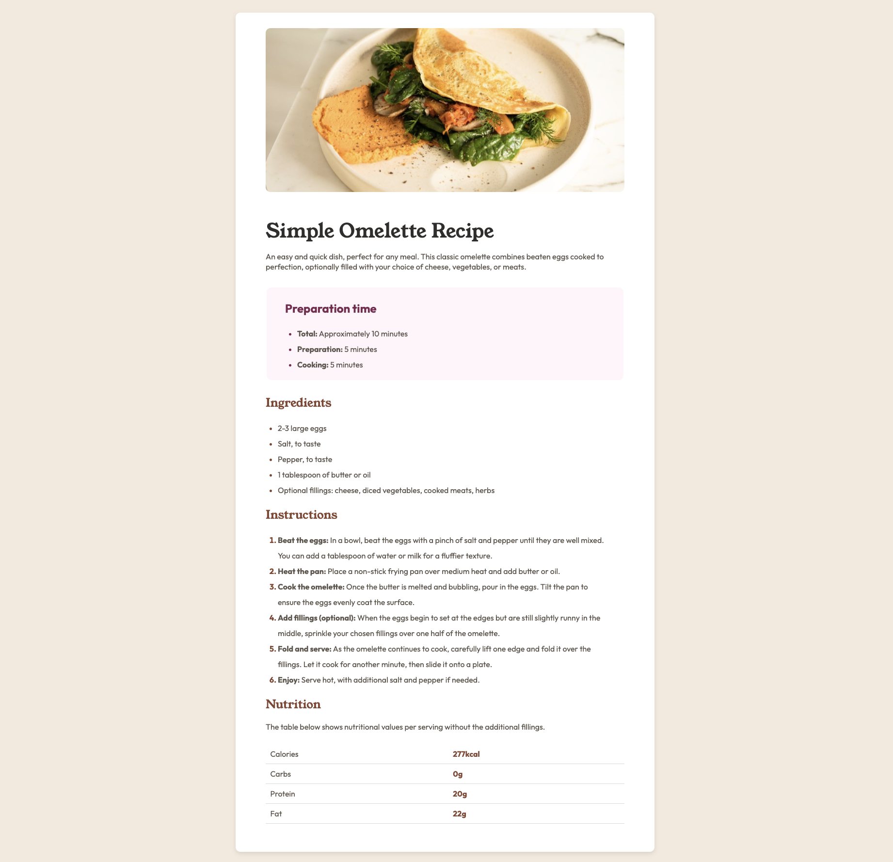

## Overview
This is my solution to the "Recipe page" challenge from [Front End Mentor](https://www.frontendmentor.io/)

### Desktop Overview

### Built with

- Semantic HTML5 markup
- CSS custom properties
- Flexbox
- Google Fonts
- Mobile-first workflow (Media Queries)

